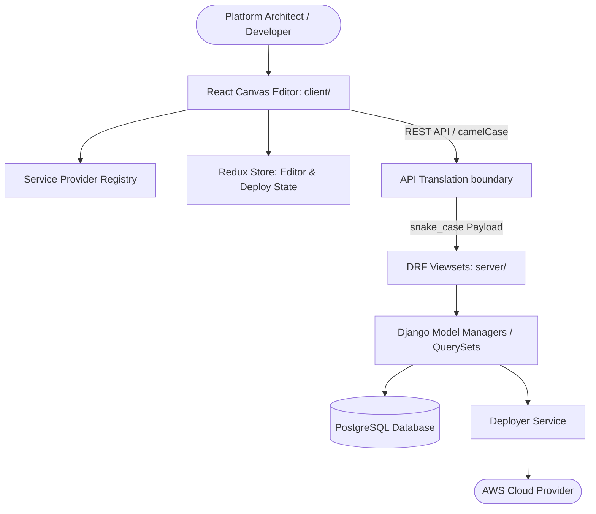

# 🎼 Orqestra

[](https://opensource.org/licenses/MIT)
[](http://makeapullrequest.com)
[]()
[]()

Orqestra is the AI-native platform for DevOps and cloud engineering. Think Cursor for DevOps: design infrastructure visually, describe your requirements in natural language, and let AI agents generate, validate, and deploy production-ready cloud architectures across AWS, Azure, and GCP.
---

## ✨ Key Features

* 🎨 **Interactive Canvas Editor**: Design complex cloud architectures visually. Link components, configure parameters, and inspect relationships using a reactive graph-based workspace powered by ReactFlow.
* ⚡ **Developer Productivity & Shortcuts**:
  * Double-click on any empty canvas area to open the floating **Quick-Add Menu** to instantly search and place services at your cursor.
  * Use speed hotkeys (`1` for Zoom to Fit, `2` for Zoom to Selection) to navigate large architecture graphs quickly.
* 🛡️ **Continuous Visual Validation**: Get real-time validation badges and error counts directly on resource cards before deploying, reducing config errors.
* 🔍 **Visual Dry-Run Diffs**: Trigger planning to display visual diff action tags (`CREATE` / `UPDATE`) directly on the nodes, mapping out Terraform/CloudFormation actions before they happen.
* 🔌 **Plugin-Based Cloud Architecture**: Treating cloud resources as provider-agnostic plugins ([registry.ts](file:///Users/rajtosh/Documents/projects/draw-to-deploy/client/src/services/registry.ts)). Adding support for new resources requires zero changes to the core orchestration layer.
* 🐳 **Containerized Developer Parity**: Full Docker Compose environment matching production environments and eliminating "it works on my machine" issues.

---

## 🏗️ Architecture Overview

Orqestra is built as a monorepo splitting client and server responsibilities:



* **Frontend (`client/`)**: Single-page application built on Vite + React + TypeScript + TailwindCSS + Shadcn UI.
* **Backend (`server/`)**: API server built on Django, Django REST Framework, and PostgreSQL.

---

## 🛠️ Getting Started

### Prerequisites
* [Docker](https://www.docker.com/products/docker-desktop/) and Docker Compose.
* *Alternative (Manual)*: Node.js v18+, Python 3.12+, PostgreSQL, AWS CLI.

---

### Quick Start with Docker (Recommended)

Orqestra is containerized for simple local boots.

1. **Configure Environment Variables**:
   Copy `.env.template` to `.env` in the root directory:
   ```bash
   cp .env.template .env
   ```
   *(Configure AWS regions, local secrets, or custom roles in this file as needed)*.

2. **Boot the Application Stack**:
   ```bash
   docker compose up --build
   ```

3. **Open the App**:
   Navigate your browser to **[http://localhost:8080](http://localhost:8080)**.

---

### Manual Setup (Local Development)

#### 1. Frontend Client
```bash
cd client
npm install
npm run dev
```
*The Vite developer server starts locally on port `8080`*.

#### 2. Backend Django Server
Ensure PostgreSQL is running and you have Python 3.12+ installed:
```bash
cd server
python -m venv .venv
source .venv/bin/activate
pip install -r requirements.txt
python manage.py migrate
python manage.py runserver 0.0.0.0:3001
```
*The backend Django server starts locally on port `3001`*.

---

## 🧪 Verification & Testing

To maintain consistency and code quality, run checks before opening a pull request.

### Backend System Validation (Docker)
Always execute database checks and backend tests inside Docker containers to ensure environment parity:

* **Django Integrity Checks**:
  ```bash
  docker compose run --rm server python manage.py check
  ```
* **Run Server Unit Tests**:
  ```bash
  docker compose run --rm server python manage.py test
  ```

### Frontend Linters & Build
Run verification builds in the client project:

* **Format and Lint Code**:
  ```bash
  npm run lint --prefix client
  ```
* **Verify Production Build**:
  ```bash
  npm run build --prefix client
  ```
* **Run Frontend Unit Tests**:
  ```bash
  npm run test --prefix client
  ```

---

## 🛡️ Cloud Credentials & Permissions
* **AWS Credentials**: The Docker Compose setup mounts your host's local `${HOME}/.aws` folder into the server container (`/root/.aws`) so the deployer API can utilize your local AWS config files.
* **IAM Execution Roles**: AWS actions are performed under execution roles. Supply an IAM Role ARN in the visual Node Inspector sidebar or configure `AWS_LAMBDA_EXECUTION_ROLE_ARN` in your local `.env`.

---

## 📜 License
Orqestra is open-source software licensed under the [MIT License](LICENSE).
