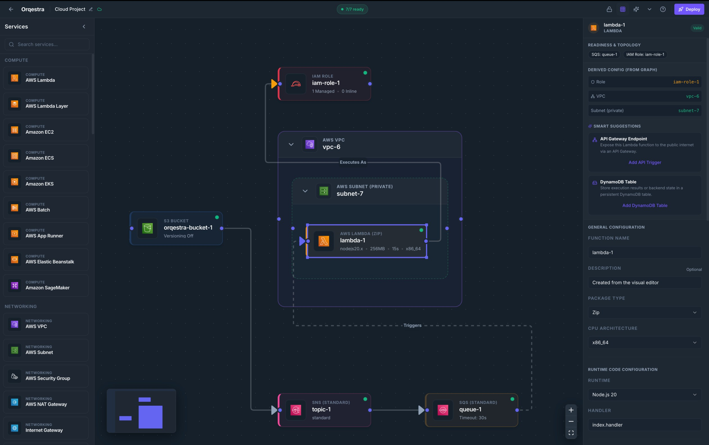

# Orqestra

Orqestra is an architecture-first cloud engineering platform that enables teams to design, validate, and deploy cloud infrastructure from a visual architecture graph.

Instead of managing infrastructure through configuration files, cloud consoles, or disconnected diagrams, Orqestra treats the architecture itself as the source of truth. Engineers can model systems visually, define relationships between resources, validate infrastructure before deployment, and generate production-ready cloud environments from a single architecture graph.

Orqestra bridges the gap between architecture design and infrastructure deployment by combining visual architecture modeling, infrastructure-as-code generation, deployment automation, and an AI agent that designs on the canvas alongside you, within a single platform.



## Table of Contents

- [Why Orqestra?](#why-orqestra)
- [Core Principles](#core-principles)
- [Key Capabilities](#key-capabilities)
- [AI Agent](#ai-agent)
- [Architecture](#architecture)
- [Getting Started](#getting-started)
- [Project Structure](#project-structure)
- [Documentation](#documentation)
- [Contributing](#contributing)
- [License](#license)
- [Vision](#vision)

## Why Orqestra?

Traditional infrastructure workflows are fragmented:

* Architecture diagrams live in tools like Draw.io, Lucidchart, or Figma.
* Infrastructure definitions live in Terraform, CloudFormation, or Pulumi.
* Cloud resources are managed through provider consoles.
* Knowledge is distributed across documentation, code, and tribal expertise.

As systems grow, architecture diagrams become outdated and infrastructure definitions become difficult to understand.

Orqestra eliminates this disconnect by making the architecture graph the canonical source of truth.

Everything derives from the graph:

* Infrastructure definitions
* Resource relationships
* Dependency management
* Validation rules
* Deployment plans
* Cost analysis
* Security analysis
* AI agent reasoning

## Core Principles

### Architecture Graph as the Source of Truth

The architecture graph is the canonical representation of infrastructure.

Resources, relationships, deployment plans, validation results, and generated infrastructure definitions are all derived directly from the graph.

### Architecture Before Configuration

Engineers should think about systems, boundaries, dependencies, and data flow, not provider-specific configuration details.

Orqestra focuses on architecture first and infrastructure implementation second.

### Relationship-Driven Infrastructure

Infrastructure is defined through meaningful relationships rather than disconnected configuration forms.

For example:

* API Gateway invokes Lambda
* EventBridge triggers Lambda
* Lambda consumes SQS
* Lambda mounts EFS
* VPC contains Subnets
* Subnets contain workloads

Relationships are first-class citizens of the platform.

### Deployable Architecture

Architecture diagrams are not documentation. Architecture diagrams are deployable.

The same graph used to design systems is used to generate deployment plans and provision cloud infrastructure.

## Key Capabilities

### Visual Architecture Design

Design cloud architectures using a hierarchical architecture canvas.

Model:

* Regions
* VPCs
* Subnets
* Security boundaries
* Application groups
* Cloud resources
* Infrastructure relationships

### Cloud Infrastructure Modeling

Build complete cloud environments using AWS services and cloud-native architecture patterns.

Examples include:

* Compute
* Networking
* Storage
* Databases
* Security
* Observability
* Event-driven architectures
* Container platforms
* Serverless systems

### Validation Engine

Validate architectures before deployment.

Detect:

* Missing dependencies
* Invalid relationships
* Security issues
* Network configuration problems
* Deployment risks
* Architecture anti-patterns

### Deployment Automation

Generate deployment plans directly from the architecture graph.

Support:

* Infrastructure provisioning
* Deployment planning
* Resource dependency management
* Change previews
* Environment deployments

### Multi-Tenant Platform

Built for teams and organizations.

Features include:

* Organizations
* Projects
* User management
* Role-based access control
* Permissions
* Auditability foundations

### AI-Native Design

An AI agent works directly on the architecture graph, using the same registry, validation, and cost engines a human does.

It can:

* Generate a complete architecture from a plain-language description
* Make in-place edits when tagged in a canvas comment
* Wire dependencies such as IAM roles, networking, and encryption
* Self-correct against validation errors
* Explain what it built and why

Because the agent edits the same graph, AI and humans genuinely share one source of truth. See [AI Agent](#ai-agent).

## AI Agent

Orqestra ships with an AI agent that designs and edits infrastructure on the canvas with you. It is not a chatbot bolted onto the editor: it acts through the same service registry, canvas helpers, and validation engines a human edit does, so every change it makes is a normal, undoable graph diff.

**Two surfaces:**

* **Agent panel** (`Cmd/Ctrl + J`) - describe an app in plain language and watch the architecture get built live on the canvas, narrated step by step. The panel is a tabbed inbox: *Chat* for the project's build conversation, *Threads* for every canvas-anchored agent thread.
* **`@orqestra` annotations** - tag the agent in a comment on a node, edge, or the canvas for a local, in-place edit. It makes the change and replies in the same thread, through the existing comment, mention, and notification system.

**How it behaves:**

* **Graded autonomy** - safe edits apply instantly and are undoable; destructive or expensive changes pause the run for confirmation.
* **Grounded** - it emits semantic graph operations (`add_resource`, `connect`, `configure`, `validate`, `estimate_cost`, …), never raw IaC, and picks services by capability rather than by hardcoded IDs.
* **Self-correcting** - validation and cost results are fed back to the model as tool results, so the platform's own engines are its guardrails.
* **Design-time only** - the agent never deploys. A human triggers deployment through the existing pipeline.

**Bring your own model.** The engine depends on a vendor-neutral `BaseLLMProvider` interface, mirroring the cloud-provider plugin pattern. Anthropic and Gemini adapters ship today; adding another is a new adapter plus a registration, with no engine changes. Configure with `AGENT_LLM_PROVIDER`, `AGENT_LLM_MODEL`, and the matching API key in `.env`. API keys stay server-side.

Full reference: [docs/ai-agent.md](./docs/ai-agent.md).

## Architecture

Orqestra is built as a monorepo with a clear separation between the visual editor, the API, and the deployment engine:

* **`client/`** - React + TypeScript frontend providing the node-based architecture canvas
* **`server/`** - Django + DRF backend handling organizations, projects, validation, deployment orchestration, and the AI agent engine
* **`deployer/`** - Service responsible for generating and executing infrastructure deployment plans

The orchestration layer is provider-agnostic by design. AWS support is implemented as a plugin, with multi-cloud support planned. LLMs are pluggable the same way, so the agent is not tied to a single model vendor. For a deeper dive into the platform design, see [docs/architecture.md](./docs/architecture.md).

## Getting Started

For a comprehensive, step-by-step onboarding guide, refer to the [Getting Started Guide](./docs/getting-started.md).

### Prerequisites

* [Docker](https://docs.docker.com/get-docker/) and [Docker Compose](https://docs.docker.com/compose/)

### Setup

1. Clone the repository:

   ```bash
   git clone https://github.com/rajtoshranjan/orqestra.git
   cd orqestra
   ```

2. Copy the environment template and adjust values as needed:

   ```bash
   cp .env.template .env
   ```

3. To use the AI agent, set an LLM provider and API key in `.env`:

   ```bash
   AGENT_LLM_PROVIDER=anthropic   # or: gemini
   AGENT_LLM_MODEL=<model-id>
   ANTHROPIC_API_KEY=<your-key>   # or GEMINI_API_KEY for gemini
   ```

   The rest of the platform runs fine without this; the agent reports that it is
   not configured until a key is set.

4. Start the local stack:

   ```bash
   docker compose up --build
   ```

This brings up the following services:

| Service     | Description                              | Default URL                |
|-------------|-------------------------------------------|-----------------------------|
| `client`    | Frontend application                     | http://localhost:8080       |
| `server`    | Django API                               | http://localhost:3001       |
| `db`        | PostgreSQL database                      | localhost:5433               |
| `redis`     | Channel layer backing real-time events   | localhost:6380               |
| `deployer`  | Deployment plan generation and execution | http://localhost:8002       |
| `ministack` | Local AWS emulator for development       | http://localhost:4566       |
| `stackport` | Web UI for inspecting the AWS emulator   | http://localhost:8082       |

### Backend management commands

Run Django management commands inside the `server` container, for example:

```bash
docker compose run --rm server python manage.py migrate
```

## Project Structure

```
orqestra/
├── client/      # React + TypeScript frontend (visual editor)
├── server/      # Django + DRF backend (API, validation, orchestration)
├── deployer/    # Infrastructure deployment engine
├── docs/        # Additional documentation
├── AGENTS.md
└── docker-compose.yml
```

## Documentation

* [docs/getting-started.md](./docs/getting-started.md) - Step-by-step guide to run and configure Orqestra for the first time
* [docs/architecture.md](./docs/architecture.md) - Platform architecture and core domain model
* [docs/ai-agent.md](./docs/ai-agent.md) - How the AI agent works, its action space, risk model, and LLM configuration
* [docs/access-control.md](./docs/access-control.md) - Roles, permissions, and multi-tenancy rules
* [AGENTS.md](./AGENTS.md) - Guidelines for contributors and AI coding agents
* [docs/](./docs) - Additional reference documentation

## Contributing

Contributions are welcome. Before opening a pull request:

1. Open an issue to discuss significant changes.
2. Follow the conventions described in [AGENTS.md](./AGENTS.md) and the relevant documents under [docs/agents](./docs/agents).
3. Ensure the application builds and tests pass locally.

## License

Orqestra is licensed under the [MIT License](./LICENSE)

## Vision

The long-term vision for Orqestra is to become the operating system for cloud architecture and infrastructure engineering: a platform where architects, engineers, operators, and AI agents collaborate through a shared architecture graph to design, understand, validate, and operate cloud systems at any scale.
